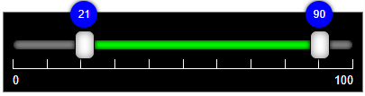

# MultiRangeSlider.vue

## No Dependency only single vue component file

A vue component that accept values in props and return changed values in @input event

 

 

 

 

 

## View Demo

[View Demo - codesandbox](https://codesandbox.io/s/multi-range-slider-vue-demo-lcmji?file=/src/App.vue)
 
[View Demo - gh-pages](https://developergovindgupta.github.io/multi-range-slider-vue/)

## Properties

| props | type    | default | description  |
| - | - | - | - |
| min          | Number  | 0       | Slider Minimum Value that user can set |
| max          | Number  | 100     | Slider Maximum Value that user can Set |
| minValue     | Number  | 25      | Slider range selected minimum value that will show default selected |
| maxValue     | Number  | 75      | Slider range selected maximum value that will show default selected  |
| step         | Number  | 1       | Slider change value that will change when bar clicked or keyboard arrow key pressed  |
| rangeMargin  | Number  | step    | Slider minValue and maxValue minimum difference. user cannot select less than rangeMargin value. If not specified then step value is min range. If rangeMargin is set to zero then user can select same minValue and maxValue |
| preventWheel | Boolean | false   | true then it not accept mouse wheel to change its value. false then (shift + wheel) change minValue (ctrl+wheel) change maxValue, (ctrl+shift+wheel) change both values |
| ruler        | Boolean | true    | is ruler visible or not. sub-ruler is display when labels are set and step not equal to 1.|
| label        | Boolean | true    | is label visible or not |
| labels | Array | [ ] | list of label text display on ruler. If not set then min-max value show in label |
|minCaption|String|""| Display on Min-Thumb tool-tip caption text. if not passed then minValue will display.|
|maxCaption|String|""| Display on Max-Thumb tool-tip caption text. if not passed then maxValue will display.|
| baseClassName | String | "multi-range-slider" | you can write your css or modify css file and apply that class. Example : "multi-range-slider-black" |
||||

## keyboard shortcuts
|keyboard shortcut|Description|
|-|-|
|Shift+Wheel|increment/decrement min value|
|Ctrl+Wheel|increment/decrement max value|
|Ctrl+Shift+Wheel|increment/decrement both values|
|Left Arrow Key|decrement selected slider thumb min/max value|
|Right Arrow Key|increment selected slider thumb min/max value|

## How to Install

copy following code and run on CLI

`npm install multi-range-slider-vue`

# How to use

Example Code

[download from gitHub](https://github.com/developergovindgupta/multi-range-slider-vue-demo "download from gitHub")

## usase

**template sectioln**

    <MultiRangeSlider
        :baseClassName="multi-range-slider"
        :min="0"
        :max="100"
        :step="10"
        :ruler="true"
        :label="true"
        :minValue="barMinValue"
        :maxValue="barMaxValue"
        @input="UpdateValues"
      />

**script section**

    import MultiRangeSlider from "multi-range-slider-vue";

**components section**

    components: {
        MultiRangeSlider
    },

**data section**

    data() {
        return {
          barMinValue: 10,
          barMaxValue: 90
        };
      },

**methods section**

    methods: {
        UpdateValues(e) {
          this.barMinValue = e.minValue;
          this.barMaxValue = e.maxValue;
        }
      }

## View Demo

[View Demo - codesandbox](https://codesandbox.io/s/multi-range-slider-vue-demo-lcmji?file=/src/App.vue)
 
[View Demo - gh-pages](https://developergovindgupta.github.io/multi-range-slider-vue/)

## License Free

## Author : Govind Prasad Gupta

### developergovindgupta

### email : govindprasadguptamca@gmail.com
